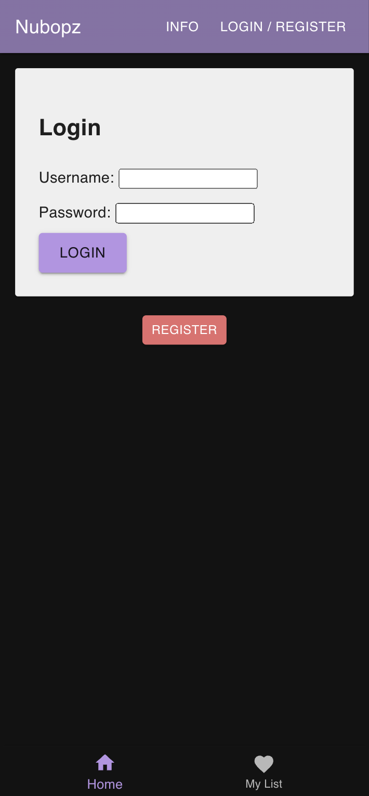
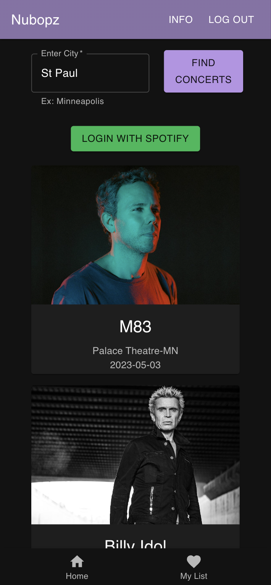
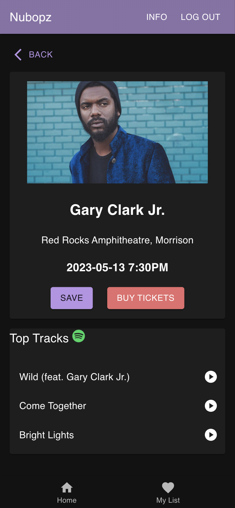
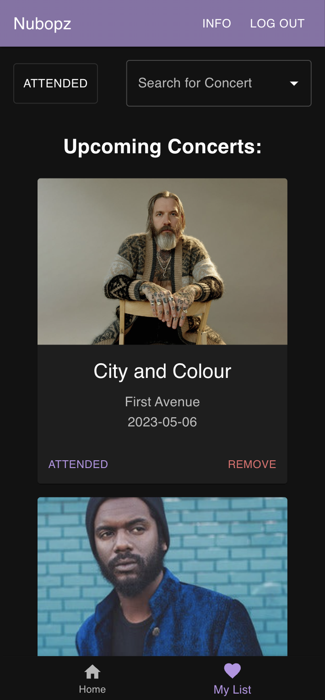
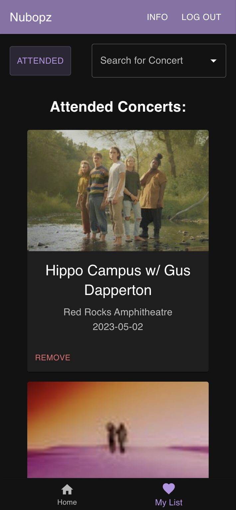
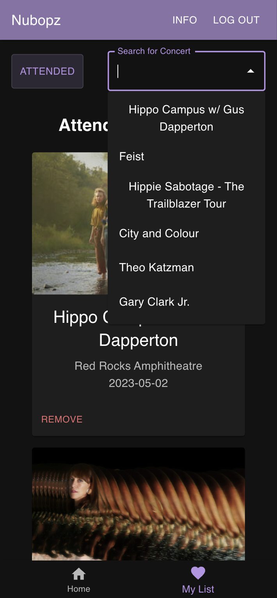
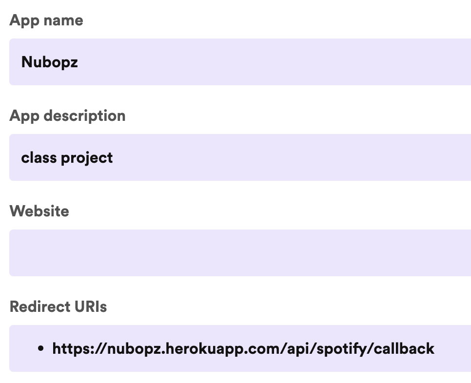

# Nubopz
Check out the deployed app [HERE](https://nubopz.herokuapp.com/)

## Description

_Duration: 2 week sprint_

This application helps music lovers find upcoming concerts in their area. After entering a city into the search bar and clicking the "FIND CONCERTS" button user's can scroll through a list of concerts populated using Ticketmaster API. Clicking on a concert will bring up details with the option to save the concert to "MY LIST" or buy tickets. Logging into Spotify will also add the ability to easily listen to top tracks of the artist to quickly become familiar with unknown bands. Going to "MY LIST" will show all upcoming saved concerts with the option of removing them from the list if no longer interested. After attending a concert a user can mark the concert "ATTENDED" and the concert will be archived. Clicking the "ATTENDED" filter button will show a record of all past concerts. There is also a convenient search bar to find specific concerts by name. With this application user's will never miss out on local concerts again and might even find new favorite bands!

## Screenshots







## Prerequisites

To run the application locally on your machine make sure you have the following software installed:

- [Node.js](https://nodejs.org/en/)
- [PostrgeSQL](https://www.postgresql.org/)
- [Nodemon](https://nodemon.io/)

Also, you will need to register and acquire API keys from both Ticketmaster and Spotify:

- [Ticketmaseter](https://developer-acct.ticketmaster.com/user/login?destination=user)
- [Spotify](https://developer.spotify.com/)

## Create database and table

Create a new database called `nubopz` and copy the SQL queries from the database.sql file and run them to create "user" and "favorites" tables. Recommend using `Postico` to run the queries as that was used to create the queries.

## Development Setup Instructions

- Run `npm install`
- Create a `.env` file at the root of the project and paste these lines into the file with your Ticketmaster and Spotify information:
  ```
  SERVER_SESSION_SECRET=superDuperSecret
  TMASTER_API_KEY=
  SPOTIFY_CLIENT_ID=
  SPOTIFY_CLIENT_SECRET=
  ```
  In the new `.env` file, take the time to replace `superDuperSecret` with some long random string like `25POUbVtx6RKVNWszd9ERB9Bb6` to keep your application secure. Here's a site that can help you: [https://passwordsgenerator.net/](https://passwordsgenerator.net/). If you don't do this step, create a secret with less than eight characters, or leave it as `superDuperSecret`, you will get a warning.

- Update the redirect_uri variable to "localhost:3000/api/spotify/callback" and make sure it matches in Spotify settings. Located in `spotify.router.js` and `SpotifyLogin.jsx`

- 

- Update client_id value in SpotifyLogin.jsx
- Update the res.redirect url's to "localhost:3000" in `spotify.router.js`

- Make sure `Postgres` database is running
- Run `npm run server`
- Run `npm run client`
- Navigate to `localhost:3000`